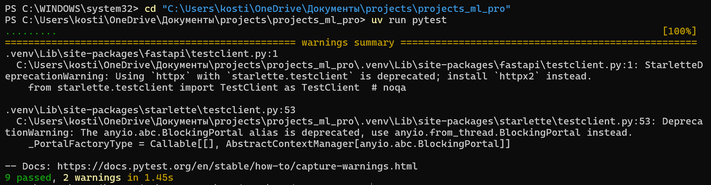
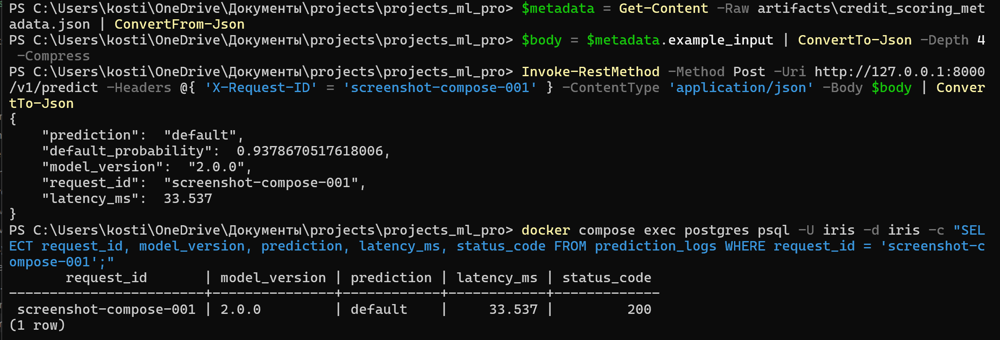
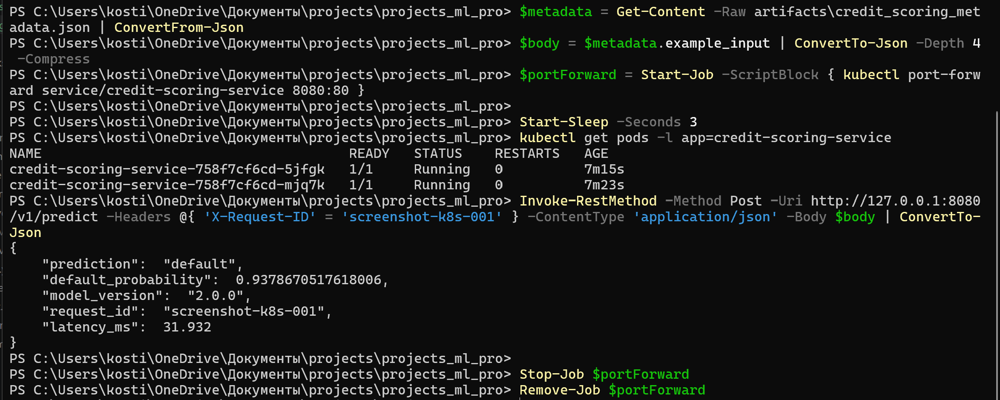
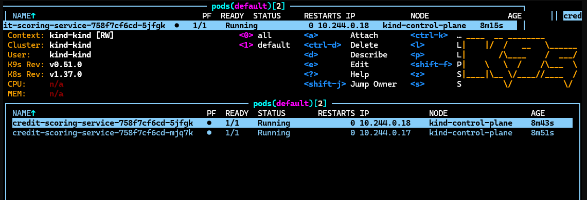

# Home Credit default-risk service

FastAPI-сервис оценивает вероятность дефолта по анкете клиента из соревнования Home Credit
Default Risk. Используется воспроизводимая `sklearn` Pipeline: feature engineering только по
заявке, заполнение пропусков, one-hot encoding, масштабирование и Logistic Regression.

Это быстрый вариант из исходного исследования: полная CatBoost v2 с кредитной историей требует
CUDA и всех исторических CSV, поэтому для сервиса выбрана его application-only baseline с
зафиксированными параметрами и reference OOF ROC-AUC `0.75141`. Подбор гиперпараметров не
выполняется.

## Первый запуск

Нужны Git, Python 3.11, Docker Desktop, `uv`, `kubectl`, kind и k9s. После клонирования:

```powershell
git clone https://github.com/GriGkos/ml-systems-lab.git
cd ml-systems-lab
uv sync
```

Перед запуском Docker Desktop должен быть открыт. Если `kind get clusters` не показывает
кластер `kind`, создайте его один раз командой `kind create cluster`.

## Проверка

Выполняйте команды сверху вниз из корня репозитория.

```powershell
uv run pytest
```

```powershell
docker compose up -d --build
```

```powershell
.\scripts\verify_kind.ps1
```

Третья команда собирает образ, загружает его в текущий kind-кластер, применяет манифесты,
ожидает rollout и получает ответ `/v1/predict` через port-forward.

## Скриншоты проверки

### Тесты



### Логирование в PostgreSQL



### Kubernetes и port-forward



### k9s



## API

После `docker compose up -d --build` доступны:

- `GET http://127.0.0.1:8000/health`
- `GET http://127.0.0.1:8000/ready`
- `POST http://127.0.0.1:8000/v1/predict`
- `GET http://127.0.0.1:8000/docs`

`POST /v1/predict` принимает поля одной анкеты Home Credit, без `TARGET` и `SK_ID_CURR`.
OpenAPI-схема перечисляет все поля, их типы и базовые ограничения; отсутствующие известные поля
обрабатываются как пропуски, а неизвестные отклоняются с `422`. Полный валидный пример входа
хранится в `artifacts/credit_scoring_metadata.json`. Ответ содержит `prediction` (`default` или
`no_default`) и `default_probability`.

Проверить логи в PostgreSQL:

```powershell
docker compose exec postgres psql -U iris -d iris -c "SELECT request_id, model_version, prediction, latency_ms, status_code FROM prediction_logs;"
```

## Локальная разработка и настройки

```powershell
uv sync
uv run python scripts/train_credit_model.py
uv run uvicorn credit_service.main:app --reload
```

Обучающий CSV по умолчанию берётся из исходного проекта Home Credit. Путь можно переопределить
переменной `CREDIT_TRAIN_DATA_PATH`. Готовый артефакт не содержит строк исходного датасета.

Настройки читаются из переменных окружения или необязательного `.env`; шаблон находится в
`.env.example`. Поддерживаются `POSTGRES_PASSWORD`, `MODEL_PATH` и `LOG_LEVEL`.
`DATABASE_URL` необязательна: без неё сервис отвечает на запросы, но не пишет логи в PostgreSQL.
Когда БД настроена, `/ready` дополнительно проверяет её доступность. Сбой журналирования не
отменяет готовый ответ модели.

## Структура

- `artifacts/` — joblib-бандл pipeline и паспорт кредитной модели.
- `src/credit_service/credit_features.py` — те же детерминированные признаки анкеты, что в
  исходном проекте.
- `notebooks/train_credit_model.ipynb` — ноутбук для воспроизводимого запуска обучения.
- `scripts/train_credit_model.py` — обучение без подбора гиперпараметров.
- `tests/` — контрактные, smoke и детерминированные тесты.
- `k8s/` — Deployment и Service для kind.
- `REPORT.md` — журнал запуска и сдачи.
